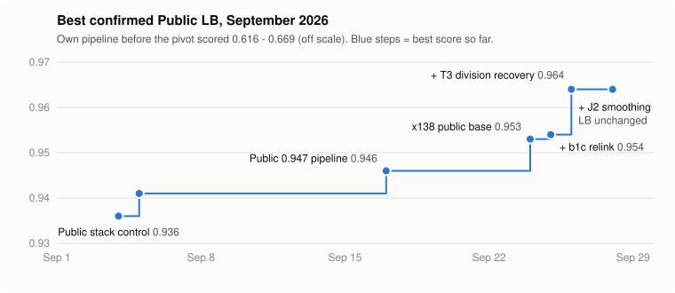
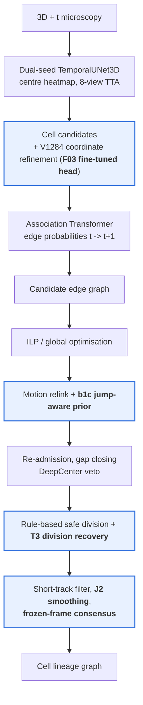

# Biohub Cell Tracking Solution

**Kaggle — Biohub: Cell Tracking During Development**

Tracking every nucleus of a developing zebrafish embryo in 3D + time light-sheet microscopy, and reconstructing
its cell lineage (who came from whom, and when cells divide).

## Competition Result

| | |
| --- | --- |
| Final Rank | 79 |
| Private LB | **0.930** |
| Public LB (best) | **0.966** |



The public score history, as a table with submission ids, is in [docs/results.md](docs/results.md).

## Overview

Each test movie is a 4D volume (`t, z, y, x`, about 100 frames, voxel 1.625 x 0.40625 x 0.40625 um). The
submission is a graph: one node per nucleus per frame, edges from frame t to t+1, and a node with two children
is a division. It is scored as

```
score = adjusted edge Jaccard + 0.1 x division Jaccard
```

with nodes matched to sparse ground truth within 7 um and an unbounded node-count factor (fewer nodes than the
organisers' estimate raises the score). The task chains five problems:

```
cell detection -> frame-to-frame association -> global graph optimisation -> lineage reconstruction -> division detection
```

**Approach in one paragraph.** After a month with our own detector and tracker (best 0.669), we adopted the strongest
public pipeline (pretrained TemporalUNet3D detector + association Transformer + ILP, Public 0.953) and spent
the rest of the competition finding where it failed and fixing exactly that. Error attribution showed that
association models were not the bottleneck; the losses were duplicated acquisition frames that broke the
motion model, and cell divisions that the ILP never produces. The team's three production components are a
**jump-aware relink (b1c)**, a **learned division scorer (T3 3D CNN)** gated by geometry and association
probabilities, and **jump-aware smoothing (J2)**. They took the Public LB from 0.953 to 0.964. Two final-day
additions, a **frozen-frame coordinate consensus** and a **fine-tuned V1284 coordinate head (F03)**, raised it to
**0.966**.

## Architecture



Blue stages contain the team's components; the rest is the public stack, used unchanged (see
[Acknowledgements](#license--acknowledgements)). Details per stage: [docs/solution.md](docs/solution.md).

## Key Contributions

| Contribution | What it is | Evidence |
| --- | --- | --- |
| **Error attribution before modelling** | Stage-by-stage attribution of every missed / false edge (72 movies), then residual-error audits of the final pipeline (88 movies) | Showed 45 % of lost edges were missing from the candidate pairs the ILP saw, and later that 46 % of remaining misses are node localisation; stopped seven association experiments that could not help ([failure analysis](docs/failure_analysis.md)) |
| **b1c jump-aware relink** | Detects bit-identical duplicated frames and, on the following "jump" transition only, adds a global translation (point-set vote + ICP) to the motion prior | 4 visible movies 0.9180 -> 0.9290; Public 0.953 -> 0.954 |
| **T3 learned division recovery** | 3-frame 3D CNN scoring candidate parents; adds gated forks (T3 >= 0.3) and removes rule-based forks (T3 < 0.01) without creating nodes | Embryo-holdout AUC 0.86 / 0.94; **Public 0.954 -> 0.964** |
| **J2 jump-aware smoothing** | Output smoothing that stops at duplicated frames and compensates jumps | 88-movie replay +0.0035 (with V5a), both embryos positive |
| **Frozen-frame coordinate consensus** | The two copies of a nucleus across a duplicated frame get their mean smoothed position; nodes and edges unchanged | 88-movie replay +0.00103, positive without any single movie; in both selected submissions |
| **F03 coordinate head** | The public V1284 head fine-tuned from its own weights with a distillation penalty (lambda 0.3) on 152 movies | Failed its pre-registered offline gate, but **Public 0.964 -> 0.966** with it (`fc` -> `fc_f03`) |
| **Validation design** | Official-metric parity, in-sample awareness of public weights, external `val_biohub`, embryo-separated threshold selection | [docs/validation.md](docs/validation.md) |
| **Exact CPU post-processing replay** | GPU inference once, then the submitted notebook's own post-processing code replayed on CPU for every configuration, scored with the official metric | Parity with the real run to 0.00003; gated every decision in the last week |
| **Kaggle pipeline engineering** | Anchor-checked, invertible edits to the public notebook; manifests; the run fails instead of silently degrading at the deadline; hash-checked candidates | [src/biohub_tracking/kaggle/](src/biohub_tracking/kaggle), `scripts/prepare_notebook.py` |
| **Experiment lineage** | Every idea with hypothesis, validation, LB and decision, including the ones that failed | [docs/experiments.md](docs/experiments.md) |

## Validation

- **Metric parity.** Local scores come only from the organisers' `tracking_cellmot` implementation, on
  predictions rounded through the submission CSV schema.
- **Leakage.** The public pretrained weights were trained on all 199 train movies, so every train-movie score is
  in-sample. It is used for *relative* post-processing decisions only, never reported as out-of-fold.
- **External validation.** `val_biohub` (Zebrahub movies with automatic Ultrack tracks) is evaluation-only:
  never used for gradients, pseudo-labels or tuning; required before any detector / association change.
- **Embryo separation.** The two training embryos (44b6, 6bba) are the independent units. T3 thresholds are
  selected on within-embryo movie-CV scores and checked on the other embryo.
- **Gates.** Pre-registered per change: +0.001 on the 88-movie replay, both embryos non-negative, robust to
  removing the best movie, and no regression on the real GPU run.

## Repository Structure

```
biohub-cell-tracking-solution/
├── README.md, LICENSE, LICENSES/, THIRD_PARTY_NOTICES.md, RELEASE_CHECKLIST.md, pyproject.toml
├── src/biohub_tracking/
│   ├── division/        T3 CNN, candidate forks, gate + scorer, add/remove, thresholds, official-rule labels
│   ├── postprocessing/  b1c relink, J2 line fit, frozen-frame consensus
│   ├── detection/       V1284 coordinate-head fine-tuning (F03, used by the selected fc_f03)
│   ├── metrics/         official metric wrapper (per-embryo reporting)
│   ├── io/              track graph, submission CSV, GT .geff reader
│   └── kaggle/          notebook fingerprinting, block extraction, candidate conversion
├── configs/             default.yaml (inherited upstream settings), final.yaml (team settings, candidates)
├── scripts/             train.py, evaluate.py, prepare_notebook.py
├── notebooks/           final_submission.ipynb (the submitted Kaggle notebook, code cells byte-identical),
│                        solution_writeup.ipynb (the Kaggle solution write-up)
├── tests/               unit tests + parity tests against the notebook's own code
└── docs/                solution, validation, experiments, failure analysis, results
```

## Installation

```bash
git clone https://github.com/YamauchiYudai/biohub-cell-tracking-solution.git
cd biohub-cell-tracking-solution
python -m venv .venv
source .venv/bin/activate
pip install -e ".[dev]"            # core + tests
pip install -e ".[torch]"          # T3 / coordinate-head training
pip install -e ".[metric]"         # local scoring with the official metric (installs from GitHub)
```

Python 3.10+. The core package needs only numpy, pandas, scipy and PyYAML.

## Data

Competition data is not included. Download it from Kaggle after accepting the competition rules:

```bash
kaggle competitions download -c biohub-cell-tracking-during-development -p ${DATA_ROOT}
unzip -q ${DATA_ROOT}/biohub-cell-tracking-during-development.zip -d ${DATA_ROOT}
```

`${DATA_ROOT}/train/` holds `<movie>.zarr` images and `<movie>.geff` ground truth; `${DATA_ROOT}/test/` the
test images. Pretrained models are Kaggle datasets listed in `configs/final.yaml` (`inputs`).

## Training

Only the team's components are trained here; the detector, Transformer and DeepCenter are public pretrained
models.

```bash
python scripts/train.py t3-crops --train-dir ${DATA_ROOT}/train --out work/t3_crops
python scripts/train.py t3 --mode holdout --crops work/t3_crops --out work/t3_holdout   # embryo holdout AUC / AP
python scripts/train.py t3 --mode inner   --crops work/t3_crops --out work/t3_inner     # scores for threshold selection
python scripts/train.py t3 --mode full    --crops work/t3_crops --out work/t3_full      # submission weights (3 seeds)
python scripts/train.py coordinate-head --pairs work/v1284_pairs.npz --public-head v1284_head.pt --out work/head_f03
```

## Inference

Inference runs as the Kaggle notebook `notebooks/final_submission.ipynb` (GPU T4 x2, internet off, an estimated
7-8 h on the hidden test set). Attach the competition data and the datasets listed in its first cell; it writes
`/kaggle/working/submission.csv`. The notebook is the exact submitted code, so no local inference script
re-implements it.

## Evaluation

```bash
python scripts/evaluate.py --submission submission.csv --check-only                 # schema + graph validity
python scripts/evaluate.py --submission submission.csv --gt-dir ${DATA_ROOT}/train  # official score per embryo
pytest -q                                                                            # unit + parity tests
```

## Reproducing the Submission

`configs/final.yaml` records each final-day candidate with its Kaggle submission id, public score and the SHA-256
of its code cells. The committed notebook is `fc_f03` (Public 0.966), one of the two selected submissions; the
other selected submission, `fc`, and every other candidate are regenerated from it by anchor-checked edits and
verified against their hash:

```bash
python scripts/prepare_notebook.py --check                  # committed notebook == recorded submission
python scripts/prepare_notebook.py --candidate fc           # the other selected submission, hash-checked
```

The team-trained weights (`biomed-x138-division-t3-full-weights`, `biomed-x138-v1284-head-f03`) are Kaggle
datasets, published after the competition deadline; `scripts/train.py` retrains them.

Verified on Kaggle (2026-09-30): the committed notebook, re-run on a T4 x2 GPU with the submission's inputs,
reproduces the `submission.csv` of submission 56663011 byte for byte on the visible movies; the package installs
on Kaggle's standard image, passes its 97 tests and runs its CLIs on real training movies and on the real team
weight files; the write-up notebook runs end to end.

## Experiments / Lessons Learned

- **Measure before modelling.** Seven association models (0.870-0.946) could not beat the control because the
  errors were elsewhere; the attribution that showed this was worth more than any of them.
- **Look at what the optimiser can express.** The ILP could not output a division at all, so the largest gain
  (+0.010) came from a post-ILP division stage, not from tuning the ILP.
- **Data quirks are real signal.** Duplicated acquisition frames explained a large share of 6bba linking errors.
- **Additions beat removals under sparse labels.** Every version that deleted rule-based divisions lost on
  hidden data, although offline tables said it was safe.
- **Distrust in-sample gains.** Several replay improvements disappeared on the real run or rested on a single
  movie; per-embryo and leave-one-movie-out checks became part of every gate.
- **Hedge what you cannot measure.** The F03 head failed its offline gate yet raised the public score to 0.966. We
  could not tell offline whether that was real, so the two selected submissions differ only in that head, and the
  private leaderboard settles it.

Full table: [docs/experiments.md](docs/experiments.md). The narrative version, written for the Kaggle solution
write-up, is [notebooks/solution_writeup.ipynb](notebooks/solution_writeup.ipynb); its code cells redraw the figures
and reproduce b1c, J2 and the division arithmetic on synthetic data (no competition data needed).

## License / Acknowledgements

The team's code is released under the MIT License ([LICENSE](LICENSE)). `notebooks/final_submission.ipynb` is a
modified version of public Kaggle notebooks and is distributed under the Apache License 2.0
([LICENSES/Apache-2.0.txt](LICENSES/Apache-2.0.txt)); see [THIRD_PARTY_NOTICES.md](THIRD_PARTY_NOTICES.md).

This solution stands on public work shared during the competition:

- **Anvith Pothula** - "biohub x138" notebook and the V1284 coordinate-refinement head (the base notebook).
- **Teddy Tennant** - "frontier947" notebooks (flow-prior relink, re-admission, gap filling).
- **Reyhan Ksatria** - the 0.947 post-processing pipeline (motion relink, gap closing, safe division, DeepCenter veto).
- **pilkwang** - pretrained TemporalUNet3D detectors, association Transformer and DeepCenter model.
- **royerlab / the organisers** - the competition, the official metric (`tracking_cellmot`) and the baseline.
