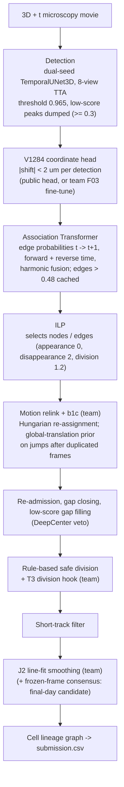

# Solution

This page describes the production pipeline stage by stage: which parts are the public upstream stack, which
parts the team added, and where each one lives in this repository.

## Problem

Each movie is a 3D + time light-sheet recording of a developing zebrafish embryo (`t, z, y, x`, voxel size
1.625 x 0.40625 x 0.40625 um, about 100 frames). The task is to output a cell-lineage graph: one node per
nucleus per frame and edges t -> t+1, where a node with two children is a division. The training set has
199 movies from two embryos (44b6: 71 movies, 6bba: 128 movies) with **sparse** ground truth: only some
nuclei are annotated, and an edge or division on an unannotated cell is neither rewarded nor penalised.

Score (official `tracking_cellmot` metric, nodes matched within 7 um):

```
score = adjusted edge Jaccard + 0.1 x division Jaccard
adjusted edge Jaccard (per movie) = edge Jaccard x (1 - 0.1 x (n_pred - n_est) / n_est)
```

The adjusted term is a (TP + FP + FN)-weighted mean over movies; the division term is pooled over all movies.
Predicting fewer nodes than the organisers' estimate `n_est` raises the factor above 1, so node count is a
lever in its own right (see [failure_analysis.md](failure_analysis.md#node-count-effects)).

## Pipeline



Stages B-E and the upstream parts of F-J come from the public notebooks listed in
[THIRD_PARTY_NOTICES.md](../THIRD_PARTY_NOTICES.md) and are used unchanged. The team's additions are marked
"(team)"; each is a block inserted into the notebook's post-processing cell or an environment override, and
each has a library restatement in `src/biohub_tracking/` whose behaviour is checked against the notebook's
own code by the test suite.

## Team components

### 1. b1c jump-aware relink - `postprocessing/relink.py`

**Problem.** In many 6bba movies the acquisition repeats a frame: frame t+1 is a bit-identical copy of frame
t (466 such *frozen* transitions in 88 audited train movies, in 55 of 66 6bba movies; none in 44b6). The
upstream relink predicts each cell's next position from the previous transition's flow field, which is 0 um
across a frozen transition. On the next transition cells move two frames' worth (often a whole-embryo
step), the true partner falls outside the 5.5 um seed gate, and cells get linked to their neighbours.

**Fix.** Classify transitions (frozen / jump / normal), and on jump transitions only add a global translation
T to the prior. T is found by a point-set cross-correlation vote (the shift that makes most source-target
pairs coincide within 1.5 um) refined by mutual-nearest-neighbour ICP. Normal transitions are untouched, so
movies without duplicated frames produce exactly the upstream edges (tested).

**Effect.** Visible train copies: 0.9180 -> 0.9290 (all from the movie with duplicated frames). Public LB
0.953 -> 0.954.

### 2. T3 learned division recovery - `division/`

**Problem.** The ILP never creates a fork (its division cost 1.2 exceeds any second-daughter edge probability),
so every division in the output comes from the rule-based safe-division stage. Turning safe division off
dropped the Public LB from 0.954 to 0.914: divisions are worth about 0.04 of score, and the rules miss many.

**Model.** T3 is a small 3D CNN on a 3-frame crop (t-1, t, t+1; 16 x 48 x 48 voxels) centred on a candidate
parent, trained on annotated divisions (positives at t-1, t, t+1, oversampled 10x) against annotated
continuing cells. Embryo-holdout AUC: 44b6 -> 6bba 0.864 (AP 0.554), 6bba -> 44b6 0.942 (AP 0.694). The
submission uses 3 seeds trained on all 199 movies with 2 test-time views.

**Hook.** Right after safe division, for every movie:

1. enumerate candidate forks P -> {D1, D2} on the graph entering safe division (`candidates.py`);
2. gate additions without a model (`scoring.py`): the Transformer probability p(P->D2) was cached (> 0.48),
   angle D1-P-D2 >= 90 deg, and the sisters separate further at t+2;
3. score the gated parents and every safe-division parent with T3;
4. add a fork when T3 >= 0.3 and remove a safe-division fork when T3 < 0.01 (`select.py`), without creating
   nodes; V5a exempts the learned additions from safe division's per-frame / global budget (`processor.py`).

Thresholds were selected on within-embryo movie-CV scores and checked on the other embryo
(`thresholds.py`, [validation.md](validation.md#division-thresholds)). **Effect:** Public LB 0.954 -> 0.964,
the largest single gain of the competition for this team.

### 3. J2 jump-aware line fit - `postprocessing/linefit.py`

The upstream output smoothing moves each node 80 % toward a line fitted through its track +-2 frames. Across a
frozen or jump transition that line mixes two alignments. J2 stops the walk at frozen transitions, subtracts
the translation b1c applied at jumps, and otherwise equals the upstream smoothing. 88-movie CPU replay:
+0.00301 (with V5a +0.00353), both embryos positive. Public LB stayed 0.964 (three-decimal display). The
insured version falls back to the upstream smoothing if J2 raises.

### 4. Final-day candidates

| Component | Code | Evidence | Status |
| --- | --- | --- | --- |
| Frozen-frame coordinate consensus: nodes linked 1:1 across a frozen transition get their mean smoothed position | `postprocessing/consensus.py` | 88-movie replay +0.00103 (6bba +0.00115, 44b6 0), 13 movies better / 1 worse | Submitted (56663004, 56663011), Public pending |
| V1284 head fine-tuned with recipe F03 (public-init, distillation weight 0.3, 152 movies) | `detection/coordinate_head.py` | Pre-registered comparison did not pass its gate; visible 4 movies +0.00135 | Submitted (56662358, 56663011), Public pending |

The committed notebook is the core both build on; `scripts/prepare_notebook.py` converts it to any candidate
and verifies the result against the recorded code hash.

## The production notebook

`notebooks/final_submission.ipynb` holds the submitted code cells byte for byte (checked by
`python scripts/prepare_notebook.py --check`). It runs on a Kaggle GPU T4 x2 with internet off:

| Cell | Owner | Role |
| --- | --- | --- |
| 0 | upstream + team | environment configuration (`configs/default.yaml` + `configs/final.yaml`) |
| 1-3 | upstream | drift guard, paths, offline dependency install |
| 4 | upstream | GPU inference: detection, coordinate head, Transformer, ILP |
| 5 | upstream + team | post-processing; team blocks: relink helpers, division runtime modules, division hook, J2 (FC) |
| 6-11 | upstream | retention guard, (disabled) validator, pipeline manifest |
| 12-13 | team | relink / division manifests; the run fails if the post-processing deadline degraded any movie |

Runtime: the hidden test rerun is estimated at about 25,000-28,000 s (from scoring times and per-movie
costs). The team raised the upstream post-processing
deadline from 27,000 s to 36,000 s and made a degraded run fail loudly instead of silently skipping the
repair stages for the remaining movies.

## Engineering practices

- **Never hand-edit third-party code.** Every team change is an insertion at an anchor that must occur exactly
  once; the edits are invertible and tested (`kaggle/variants.py`).
- **Exact CPU replay.** Inference runs once on a GPU and stores its intermediate graphs; the notebook's own
  post-processing code is then executed on CPU for many configurations and scored with the official metric
  (see [validation.md](validation.md#cpu-replay)).
- **Parity tests.** The library code in `src/` is checked against the code embedded in the notebook on random
  synthetic movies (division candidates, selection, the full scorer and hook, relink, J2, consensus).
- **Fail loudly.** Missing weights, drifted configuration, or a degraded deadline stop the run rather than
  producing a silently different submission.
